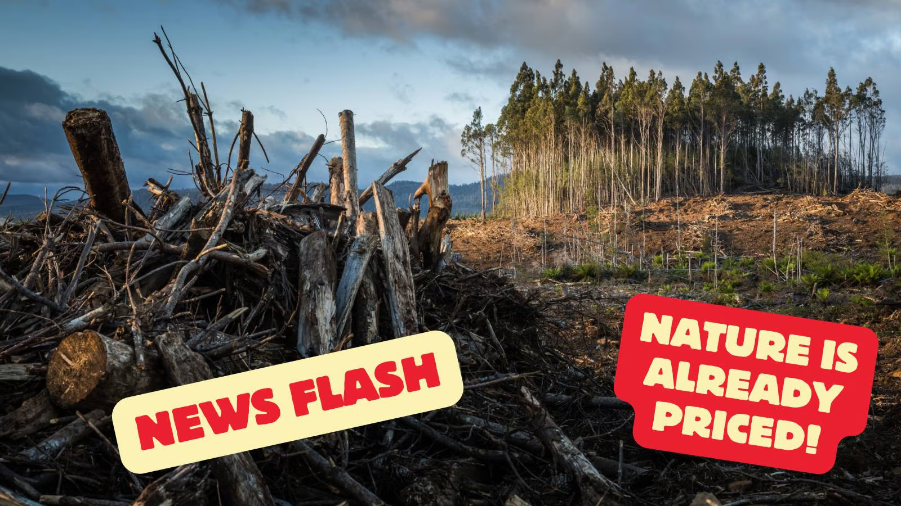

# FAQ

This is our main FAQ; new Q\&A are being added regularly. We have broken it down into sections but several overlap so feel free to use the [AI assisted search box](https://docs.basin.global/provenance/the-basin-field-manual?q=) up top.

We [welcome](contact.md) your questions and comments as well.

## Nature's Core Benefits

Is it wrong to put a price on nature? I am troubled by the idea of applying market logic to natural resources.

Nature is already priced:\
\

## RealValue of Natural Capital

why the heck are real assets included in a nature framework?

It's strategic. In a world of rules, we turn legal 'limitations' [into tools](https://dispatches.basin.global/the-tools-we-have) for sustainable impact. Laws aren't barriers; they're opportunities.

## Ecological Ensurance

Does ensurance negate the need for insurance?

Certainly not as insurance is the prudent thing to do.  However ensurance is specifically designed to lower insurance premiums for insureds and underwriting risk for carriers.

Does ensurance prevent or limit other types of credit or certificate sales?

Absolutely not! Ensurance is designed to finance the land based on the real asset price and project costs. Once the land is ensured, we expect and encourage other credit types to be "stacked" on top or "bundled" with ensurance to enhance project feasibility. The notable concern is reconciliation of other credit sales with the re-issuance and/or release of Certificates of Ensurance for the project.

## BASIN Protocol

What chain is BASIN on?

Our main .basin (ERC-721) contract is on Polygon.  However the ERC-6551 Tokenbound contract and .basin 0x accounts are the same across all EVM's. Our main STREAMS (ERC-1155) contract is on Polygon as well but we are working on cross-chain implementation for this also.

