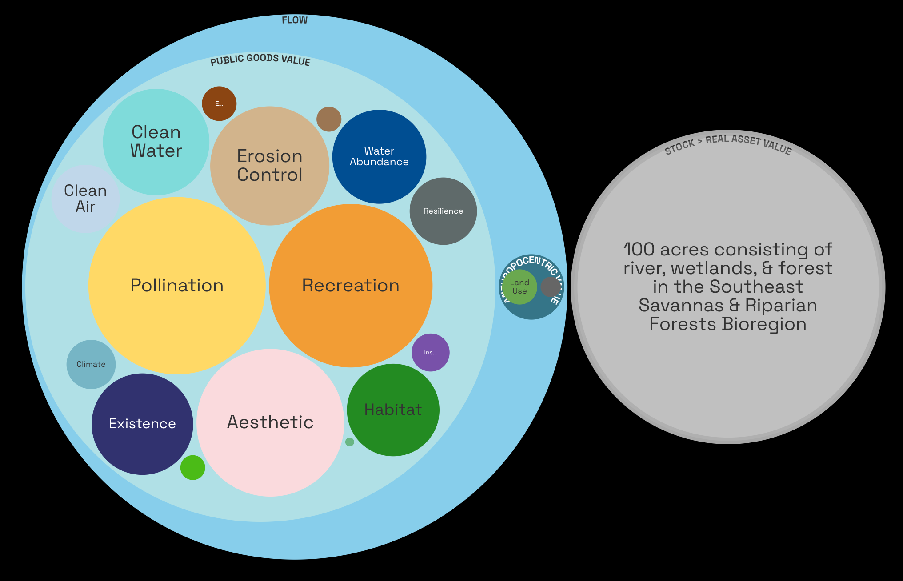

# Examples of RealValue

Here are selected expressions of RealValue. The most current iterations can be found at [BASIN Dispatches](https://dispatches.basin.global/).

## Pilot Sites

These are three sites we have assessed for [Ecological Ensurance](broken-reference).

<figure><figcaption></figcaption></figure>

<figure><figcaption></figcaption></figure>

<figure><figcaption></figcaption></figure>

## RealValues Visuals

RealValues for one site expressed in different visuals.

<figure><figcaption></figcaption></figure>

<figure><figcaption></figcaption></figure>

<figure><figcaption></figcaption></figure>
